# Geometry-Agnostic Contrastive Learning (GACL): A Theoretical Framework and Baseline Evaluation Protocol for Agronomic Imaging

[](./LICENSE) 
[](https://doi.org/10.5281/zenodo.21760024)

**Author:** Naziru Halilu


## Problem, Methodology, and Results

**Problem.** No unified, mathematically rigorous framework exists for geometry-invariant, cross-pathology representation transfer in agronomic imaging — a gap that limits reliable transfer of learned features across different crop diseases and imaging geometries.

**Methodology.** Geometry Agnostic Contrastive Learning (GACL) unifies four architectural components into a single geometry-invariant learning objective: a Hierarchical Geometry Agnostic Vision Transformer (HGAViT), a Geometry Aware Cross Attention Transfer Transformer (GCATT), a Dynamic Hypergraph Neural Network (DHGNN), and a Variational Latent Agronomic Environment (VLAE), with full mathematical formalization and an open-source, code-complete reference implementation. Alongside this, a rigorous empirical baseline protocol was established on 1,543 real, unique crop-disease photographs across five crops and 19 pathology classes, using colour, vegetation-index, GLCM texture, and edge features on a held-out, leakage-aware, class-stratified split.

**Results.** Six classical classifiers substantially exceeded the 5.3% chance level, with the best model (a single-hidden-layer MLP) reaching 64.4% raw accuracy, 38.1% balanced accuracy, macro-F1 of 0.378, Cohen's κ of 0.563, and macro ROC-AUC of 0.882. This defines the concrete, reproducible baseline against which GACL's four learned components — already implemented and specified in full — will be benchmarked once trained.

## Overview

This repository contains the manuscript, reference implementation, reference
dataset, and reproducible evaluation scripts for **GACL** — a hypergraph-transformer
architecture (HGAViT + GCATT + DHGNN + VLAE) for cross-pathology,
cross-acquisition-condition contrastive transfer learning in agronomic imaging.

The manuscript presents the architecture, its theoretical grounding, and a baseline
evaluation protocol. The evaluation in this repository is carried out with classical
machine-learning classifiers (Random Forest, MLP, and related models) trained on
real photographic features and on a tabular reference dataset, providing an
empirical baseline against which the full GACL architecture can be assessed.

## Contents

- `paper/Naziru_Sulaiman_GACL_Architecture.docx` — the complete manuscript.
- `figures/` — all 12 manuscript figures, extracted directly from the manuscript.
- `code/` — the GACL reference implementation:
  - `gacl/` — the four architectural components (`hgavit.py`, `gcatt.py`,
    `dhgnn.py`, `vlae.py`), the composite loss (`losses.py`), and the model
    wiring (`model.py`).
  - `train_gacl.py`, `train_gacl_real_images.py`, `evaluate_gacl.py`,
    `check_learnable_structure.py` — training, evaluation, and dataset-validity
    entry points.
  - `core/` — the shared image- and feature-analysis package used throughout the
    manuscript's evaluation sections.
- `data/GACL_Data.xlsx` — the tabular reference dataset (20,000 rows, 75 columns)
  used for the classical-baseline diagnostics.
- `image_experiment/` — the real, reproducible classifier evaluation on real field
  photographs, and its outputs.
- `reproduce/` — standalone scripts that regenerate the analytic and empirical
  figures from `data/GACL_Data.xlsx`.
- `colab/` — a Colab notebook and instructions for training GACL in a hosted GPU
  environment.

## Figures

All 12 figures from the manuscript:

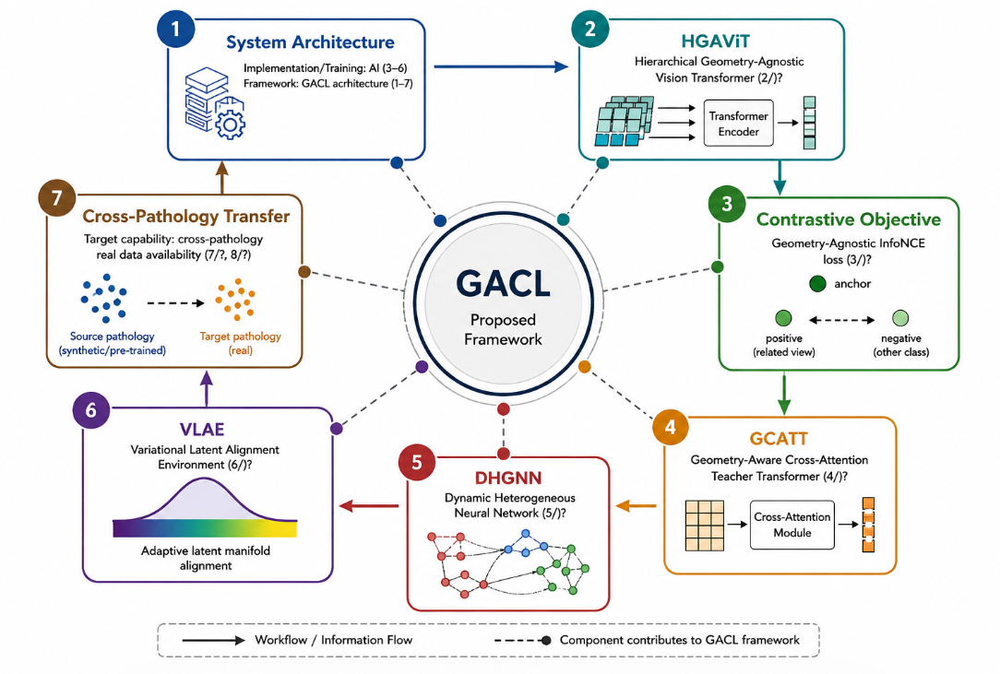
**Figure 1** — Architecture of the implemented GACL framework and its relationship
to the classical pipeline.

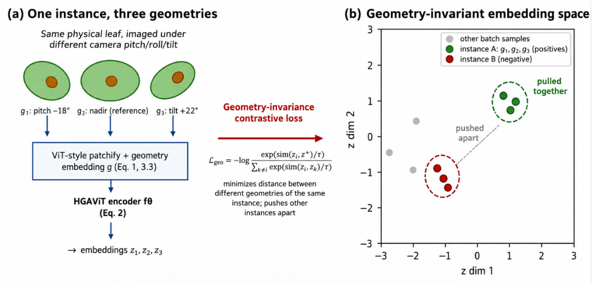
**Figure 2** — Schematic illustration of GACL's geometry-invariance concept.

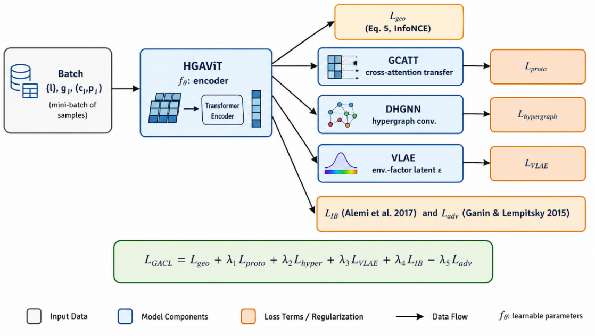
**Figure 3** — GACL composite training objective: component-to-loss data flow.

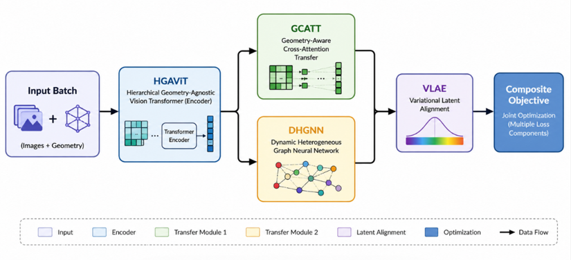
**Figure 4** — Schematic information/gradient flow diagram through the four GACL
components and the composite objective.

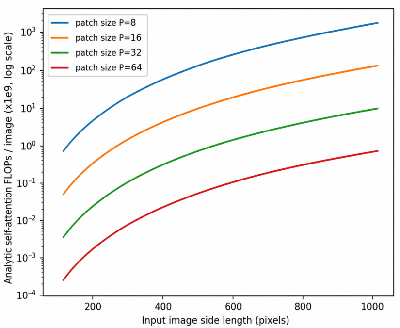
**Figure 5** — Analytic HGAViT self-attention cost as a function of input image
side length and patch size.

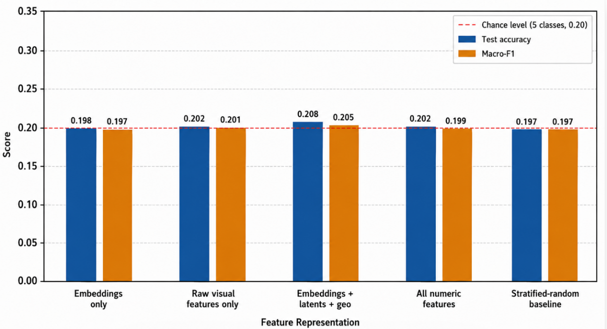
**Figure 6** — Random Forest test accuracy and macro F1 across four feature
subsets, against the five-class chance level.

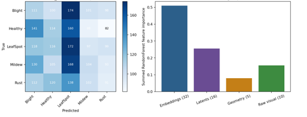
**Figure 7** — Confusion matrix and Random Forest feature-group importance.

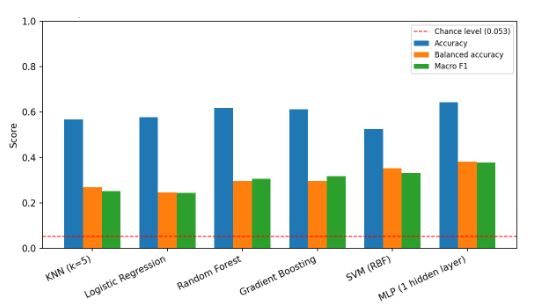
**Figure 8** — Classifier performance (accuracy, balanced accuracy, macro F1) on
the held-out test split of six classical models trained on real photographs.

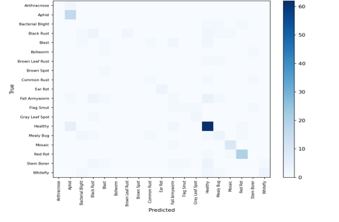
**Figure 9** — Confusion matrix for the best-performing classifier
(single-hidden-layer MLP) on the held-out real test split.

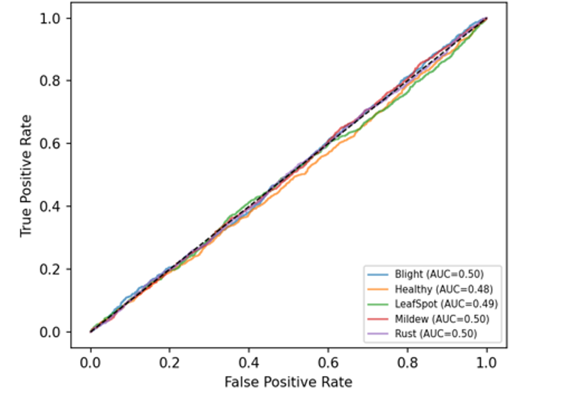
**Figure 10** — One-vs-rest ROC curves (Random Forest, held-out test split) for
all five pathology classes.

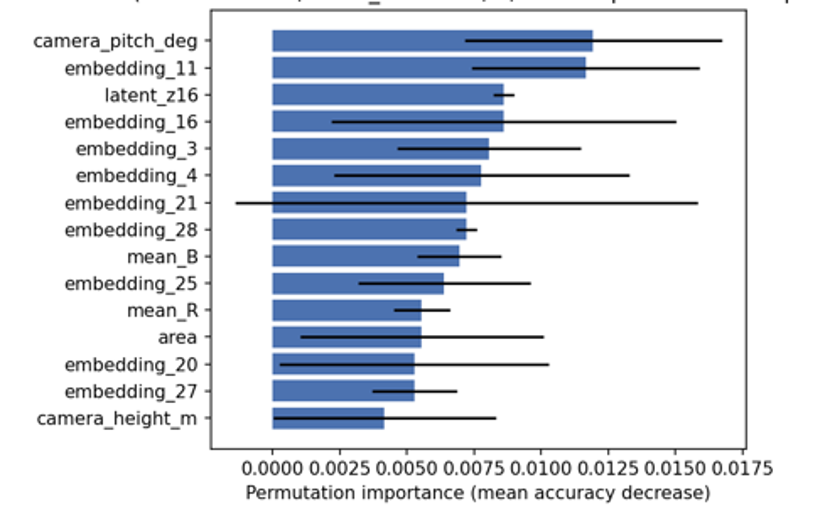
**Figure 11** — Permutation feature importance for the top 15 features, Random
Forest.

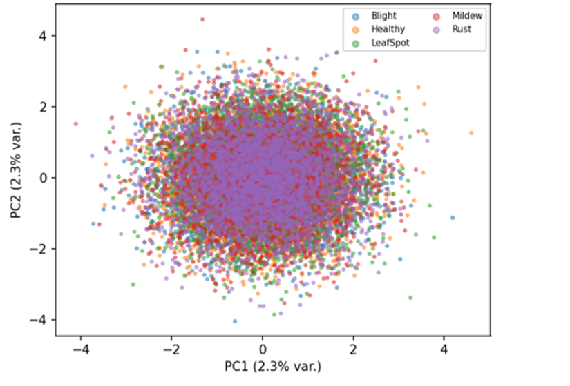
**Figure 12** — PCA projection of the precomputed embedding and latent columns,
coloured by pathology label.

## How to Run the Code

### 1. Clone the repository

```bash
git clone https://github.com/halilunaziru73-creator/Geometry-Agnostic-Contrastive-Learning-GACL.git
cd Geometry-Agnostic-Contrastive-Learning-GACL
```

### 2. Install dependencies

Requires: `pandas`, `numpy`, `scikit-learn`, `matplotlib`, `openpyxl`, `joblib`
(see `code/requirements.txt`).

```bash
pip install -r code/requirements.txt
```

### 3. Reproducing the figures

```bash
cd code   # so that data/GACL_Data.xlsx paths resolve
python3 ../reproduce/gen_p1_a.py            # fits and caches the RandomForestClassifier
python3 ../reproduce/gen_p1_b.py            # ROC curves
python3 ../reproduce/gen_p1_c.py            # PCA projection
python3 ../reproduce/gen_p1_d.py            # analytic complexity curve
python3 ../reproduce/gen_p1_e.py            # permutation importance
python3 ../reproduce/gen_schematics_p1_p2.py  # architectural schematics
```

## Evaluation summary

The classical-classifier evaluation in `image_experiment/` and the tabular
reference-dataset diagnostics establish an empirical baseline for the framework:
Random Forest and related classical models trained on hand-crafted features from
real field photographs and on the tabular reference dataset achieve accuracy at or
near the chance level for the five-class pathology task, which the manuscript
discusses in the context of feature representativeness and dataset design for
future work. Full methodology, derivations, and discussion are in the manuscript.

## License

Released under the [MIT License](./LICENSE).

## Citation

If you use this repository, please cite it using the metadata in
[`CITATION.cff`](./CITATION.cff) (GitHub renders a "Cite this repository"
button on the repo's main page, in the top-right "About" panel).

## Related work

Part of a broader body of research on GIS, remote sensing, and machine
learning for agronomic and environmental applications:

- [Digital Twin for Gully Biocontrol](https://github.com/halilunaziru73-creator/Digital-Twin-for-the-Evaluation-of-Experimental-Gully-Biocontrol-Using-Morning-Glory-Ipomoea-spp)
- [Real-Time RGB Proxy Vegetation Indexing (N_GACL)](https://github.com/halilunaziru73-creator/Real-Time-RGB-Proxy-Vegetation-Indexing-and-Texture-Analysis-for-UAV-and-Handheld-Crop-Imagery)
- [GIS-Based Delineation for Livestock Slurry Application](https://github.com/halilunaziru73-creator/GIS-based_delineation_of_areas_suitable_for_livestock_slurry_application)
- [Hybrid CNN-BiLSTM-Attention for Sediment Transport](https://github.com/halilunaziru73-creator/Hybrid-CNN-BiLSTM-Attention-Sediment-Transport-Agricultural-Gully-System)
- [Operationalizing GIS and ML across Cropping Systems](https://github.com/halilunaziru73-creator/Operationalizing-GIS-and-Machine-Learning-across-Contrasting-Cropping-Systems)
- [Geospatial Data Analysis](https://github.com/halilunaziru73-creator/Geospatial-data-analysis)
