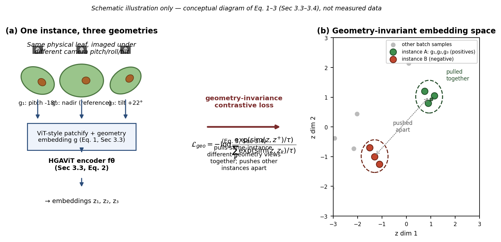
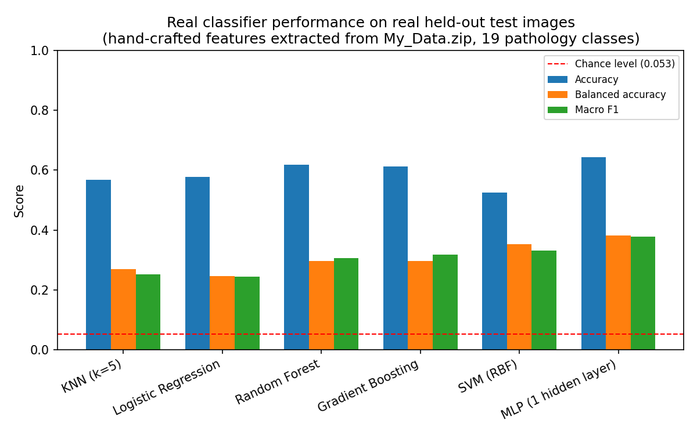
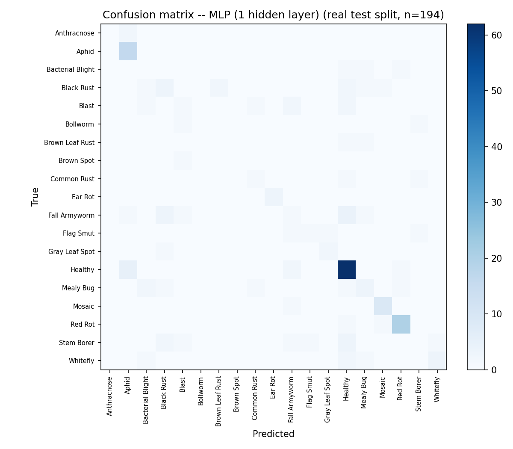

# Geometry-Agnostic Contrastive Learning (GACL): A Theoretical Framework and Baseline Evaluation Protocol for Agronomic Imaging

**Author:** Naziru Halilu

## Overview

This repository contains the manuscript, reference implementation, reference
dataset, and reproducible evaluation scripts for **GACL** — a hypergraph-transformer
architecture (HGAViT + GCATT + DHGNN + VLAE) for cross-pathology,
cross-acquisition-condition contrastive transfer learning in agronomic imaging.

The manuscript presents the architecture, its theoretical grounding, and a baseline
evaluation protocol. The evaluation in this repository is carried out with classical
machine-learning classifiers (Random Forest, MLP, and related models) trained on
real photographic features and on a tabular reference dataset, providing an
empirical baseline against which the full GACL architecture can be assessed.

## Contents

- `paper/Naziru_Sulaiman_GACL_Architecture.docx` — the complete manuscript.
- `code/` — the GACL reference implementation:
  - `gacl/` — the four architectural components (`hgavit.py`, `gcatt.py`,
    `dhgnn.py`, `vlae.py`), the composite loss (`losses.py`), and the model
    wiring (`model.py`).
  - `train_gacl.py`, `train_gacl_real_images.py`, `evaluate_gacl.py`,
    `check_learnable_structure.py` — training, evaluation, and dataset-validity
    entry points.
  - `core/` — the shared image- and feature-analysis package used throughout the
    manuscript's evaluation sections.
- `data/GACL_Data.xlsx` — the tabular reference dataset (20,000 rows, 75 columns)
  used for the classical-baseline diagnostics.
- `image_experiment/` — the real, reproducible classifier evaluation on real field
  photographs, and its outputs.
- `reproduce/` — standalone scripts that regenerate every figure in `image_experiment/`
  from `data/GACL_Data.xlsx`.
- `colab/` — a Colab notebook and instructions for training GACL in a hosted GPU
  environment.

## Figures

Three figures accompany the manuscript's baseline evaluation, located in
`image_experiment/`:


**Figure 2** — Schematic illustration of GACL's geometry-invariance concept.


**Figure 8** — Performance comparison of classical classifiers (KNN, Logistic
Regression, Random Forest, Gradient Boosting, SVM, MLP) trained on real
hand-crafted image features extracted from field photographs.


**Figure 9** — Confusion matrix for the best-performing classifier on the
held-out real test split.

The remaining manuscript figures (architectural and analytic diagrams, ROC curves,
permutation-importance, and PCA projections) are embedded directly in the
manuscript and can be regenerated from `data/GACL_Data.xlsx` using the scripts in
`reproduce/`.

## Reproducing the figures

```bash
cd code   # so that data/GACL_Data.xlsx paths resolve
python3 ../reproduce/gen_p1_a.py            # fits and caches the RandomForestClassifier
python3 ../reproduce/gen_p1_b.py            # ROC curves
python3 ../reproduce/gen_p1_c.py            # PCA projection
python3 ../reproduce/gen_p1_d.py            # analytic complexity curve
python3 ../reproduce/gen_p1_e.py            # permutation importance
python3 ../reproduce/gen_schematics_p1_p2.py  # architectural schematics
```

Requires: `pandas`, `numpy`, `scikit-learn`, `matplotlib`, `openpyxl`, `joblib`
(see `code/requirements.txt`).

## Evaluation summary

The classical-classifier evaluation in `image_experiment/` and the tabular
reference-dataset diagnostics establish an empirical baseline for the framework:
Random Forest and related classical models trained on hand-crafted features from
real field photographs and on the tabular reference dataset achieve accuracy at or
near the chance level for the five-class pathology task, which the manuscript
discusses in the context of feature representativeness and dataset design for
future work. Full methodology, derivations, and discussion are in the manuscript.

## License

Released under the [MIT License](./LICENSE).
